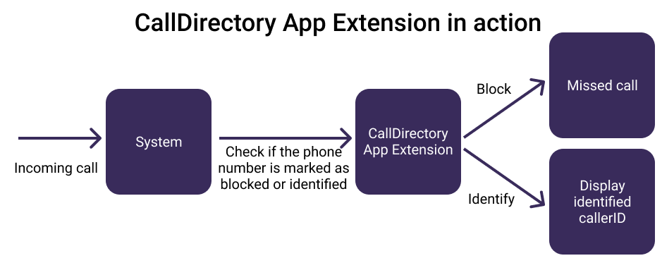
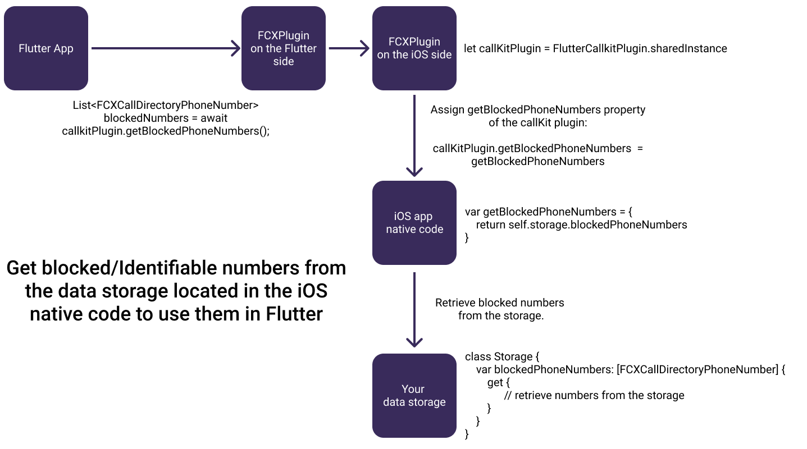

# flutter_callkit_voximplant + CallKit CallDirectory App Extension

Apps can create a Call Directory app extension to identify and block incoming callers by their phone number.



## How to implement Call Blocking and Identification

### 1. Create a Call Directory App Extension

> An iOS CallDirectory App Extension must be created and implemented, an example 
> of implementation can be found [here](../../example/ios/CallDirectoryExtensionExample/CallDirectoryHandler.swift) 

You can create a Call Directory extension for your containing app by adding a new project target
and selecting the Call Directory Extension template under Application Extensions in XCode.


[More on iOS app extensions](https://developer.apple.com/library/archive/documentation/General/Conceptual/ExtensibilityPG/index.html#//apple_ref/doc/uid/TP40014214)

### 2. Create an iOS located data storage for the phone numbers

Data storage is needed to share numbers between the app and CallDirectory extension, a basic example of 
the UserDefaults as the storage implementation can be found [here](../example/ios/Runner/UserDefault.swift)
 
### 3. Connect the data storage with the extension

In the app extension use the data storage to retrieve blocked/identified numbers from there and 
pass them to CXCallDirectoryExtensionContext.

```swift
@UserDefault("blockedNumbers", defaultValue: [])
private var blockedNumbers: [BlockableNumber]

@UserDefault("identifiedNumbers", defaultValue: [])
private var identifiedNumbers: [IdentifiableNumber]

func updateNumbers() {
    blockedNumbers.forEach {
        context.addBlockingEntry(withNextSequentialPhoneNumber: $0.number)
    }

    identifiedNumbers.forEach {
        context.addIdentificationEntry(
            withNextSequentialPhoneNumber: $0.number,
            label: $0.label
        )
    }
}

```

### 4. Connect the data storage with the CallKit plugin

In the iOS native code connect the data storage with the plugin to receive
Flutter method calls (get/add/remove numbers).
Assign FlutterCallkitPlugin instance closure-properties to functions that interact with the storage so that 
link the storage to the plugin.

```swift
// the plugin
private let callKitPlugin = FlutterCallkitPlugin.sharedInstance

// the storage
@UserDefault("blockedNumbers", defaultValue: [])
private var blockedNumbers: [BlockableNumber]

// the connection with the plugin
func connectStorage() {
    callKitPlugin.getBlockedPhoneNumbers = { [weak self] in
        guard let self = self else { return [] }
        return self.blockedNumbers.compactMap {
            if $0.isRemoved {
                return nil
            } else {
                return FCXCallDirectoryPhoneNumber(number: $0.number)
            }
        }
    }

    callKitPlugin.didAddBlockedPhoneNumbers = { [weak self] numbers in
        guard let self = self else { return }
        self.blockedNumbers.append(
            contentsOf: numbers.map { BlockableNumber(blockableNumber: $0) }
        )
        self.blockedNumbers.sort()
    }

    callKitPlugin.didRemoveBlockedPhoneNumbers = { [weak self] numbers in
        guard let self = self else { return }
        self.blockedNumbers = self.blockedNumbers.map { number in
            if numbers.contains(where: { $0.number == number.number }) {
                return number.copyWithRemovalMark
            } else {
                return number
            }
        }
    }
}
```

### 5. Use FCXPlugin in Flutter code to get/add/remove identified/blocked numbers

- #### Get numbers

Call FCXPlugin.get methods to retrieve blocked/identified
numbers from the storage in the iOS native code.



```dart
Future<List<FCXCallDirectoryPhoneNumber>> getBlockedNumbers() async {
  return await _plugin.getBlockedPhoneNumbers();
}
Future<List<FCXIdentifiablePhoneNumber>> getIdentifiedNumbers() async {
  return await _plugin.getIdentifiablePhoneNumbers();
}
```

- #### Add or remove numbers

Call FCXPlugin.add/remove methods to send blocked/identified
numbers from the Flutter to the iOS native code and save them in the storage.


```dart
Future<void> addBlockedNumber(String number) async {
  int num = int.parse(number);
  await _plugin.addBlockedPhoneNumbers(
    [FCXCallDirectoryPhoneNumber(num)],
  );
}

Future<void> removeBlockedNumber(String number) async {
  int num = int.parse(number);
  await _plugin.removeBlockedPhoneNumbers(
    [FCXCallDirectoryPhoneNumber(num)],
  );
}

Future<void> addIdentifiedNumber(String number, String id) async {
  int num = int.parse(number);
  var phone = FCXIdentifiablePhoneNumber(num, label: id);
  await _plugin.addIdentifiablePhoneNumbers([phone]);
}

Future<void> removeIdentifiedNumber(int number) async {
  await _plugin.removeIdentifiablePhoneNumbers(
    [FCXCallDirectoryPhoneNumber(number)],
  );
}
```

### 6. Reload extension to request extension data reload 

After updating the storage, to let the changes take effect, CallDirectory App Extension must be reloaded,
a request to reload might be sent via FCXCallDirectoryManager.reloadExtension method.


```dart
Future<void> reloadExtension() async {
  await FCXCallDirectoryManager.reloadExtension(_extensionID);
}
```

### Reference

[iOS CallKit Framework Documentation by Apple](https://developer.apple.com/documentation/callkit)

[App Extension Programming Guide by Apple](https://developer.apple.com/library/archive/documentation/General/Conceptual/ExtensibilityPG/index.html#//apple_ref/doc/uid/TP40014214)

[Example app by Voximplant](../../example)