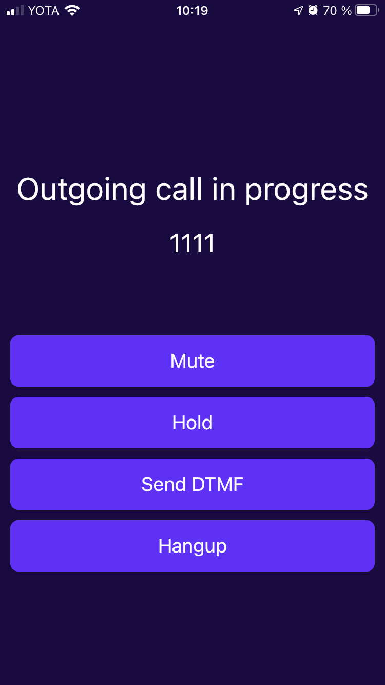
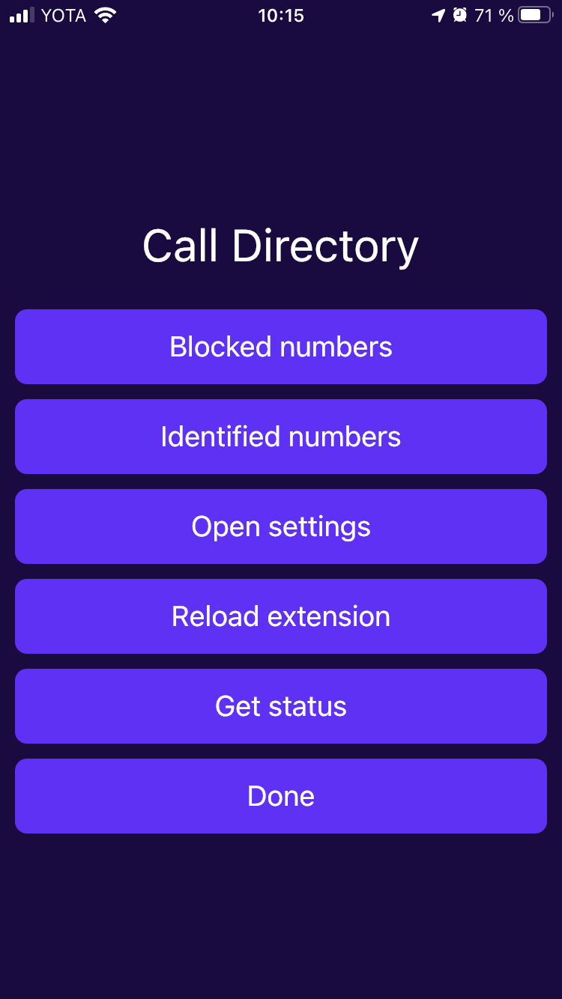
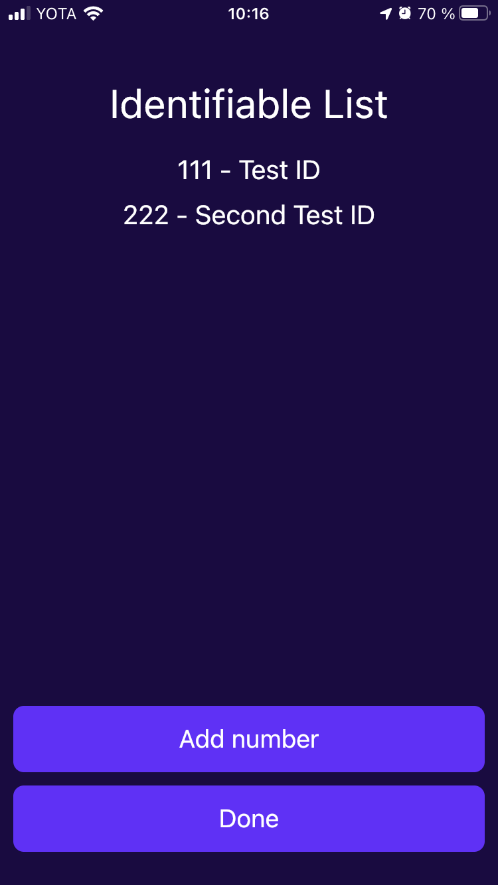

# flutter_callkit_example

Demonstrates how to use the flutter_callkit plugin.
Creates and manages CallKit call using Flutter CallKit SDK.
Implements iOS CallDirectory App Extension 

## Features

### Main screen
  
- Simulate outgoing call
- Simulate incoming call
- Simulate incoming call with 3 sec. delay

### Call screen

- Simulate call mute/unmute
- Simulate call hold/resume
- Simulate DTMF
- Simulate hangup

### CallDirectory screen
  
- Get/add/remove blocked numbers
- Get/add/remove identified numbers
- Open Phone Blocking & Identification settings
- Request to reload CallDirectory App Extension
- Get enabled status of the CallDirectory App Extension

